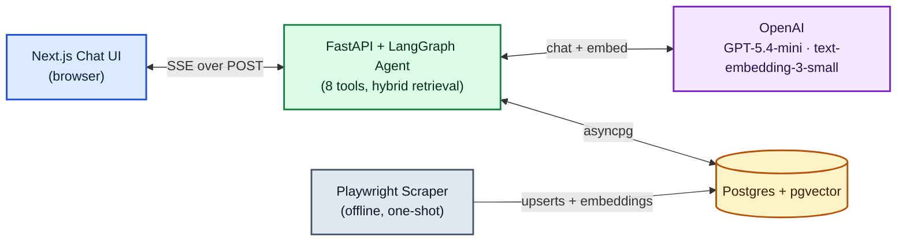
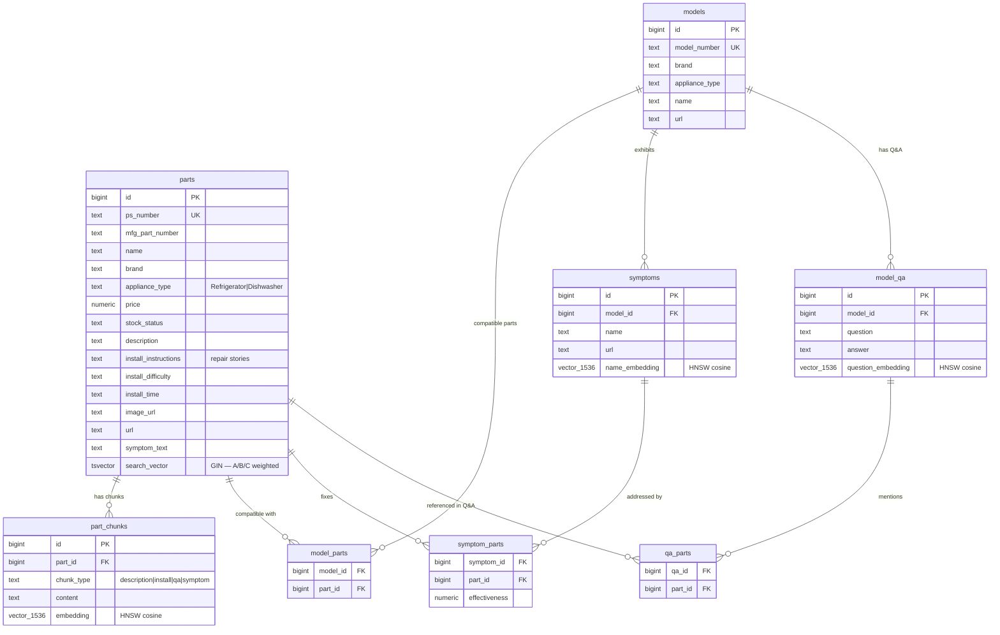
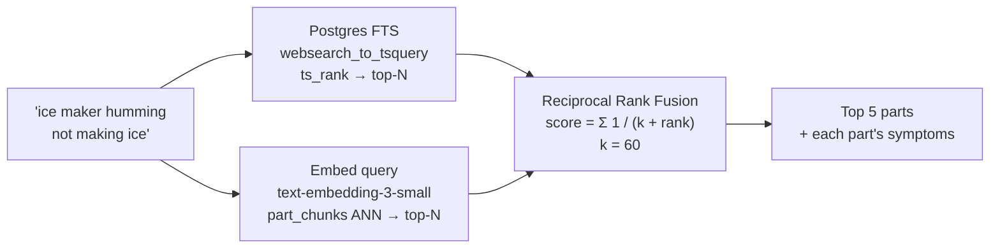
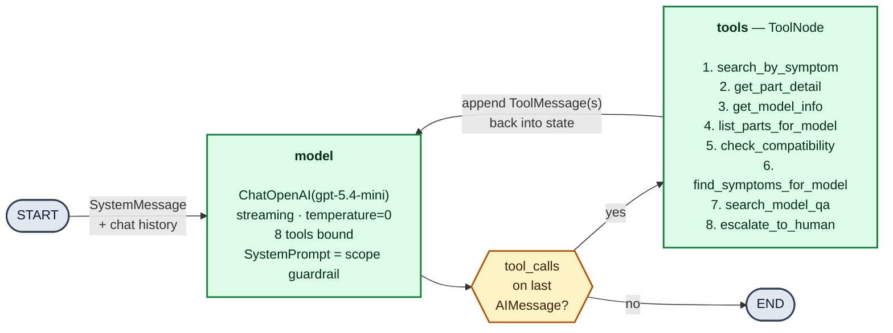
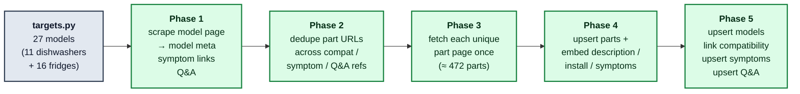

# PartSelect Conversational Agent

A streaming, tool-using chat agent that helps customers find **Refrigerator** and **Dishwasher** replacement parts on [PartSelect](https://www.partselect.com), verify model compatibility, troubleshoot symptoms, and walk through installation. The agent is **strictly scoped** to these two appliance categories and politely declines anything else.

Built as a case study with an end-to-end stack: a Playwright scraper feeds a Postgres + pgvector knowledge base, a LangGraph agent backed by GPT-5.4-mini calls eight purpose-built tools, FastAPI streams the result over SSE, and a Next.js 15 / React 19 frontend renders both the prose **and** tool-aware rich cards as the response unfolds.

---

## Live Deployment

| Service  | URL                                                                                              |
| -------- | ------------------------------------------------------------------------------------------------ |
| Frontend | [https://partselect-frontend.onrender.com](https://partselect-frontend.onrender.com)             |
| Backend  | [https://partselect-backend.onrender.com](https://partselect-backend.onrender.com)               |

> Both services run on Render's free tier — the first request after a period of inactivity may cold-start for ~30 s.

---

## Tech stack

| Layer        | Choice                                                                |
| ------------ | --------------------------------------------------------------------- |
| Frontend     | Next.js 15, React 19, TypeScript, server-sent events (`fetch` reader) |
| Backend      | FastAPI, Uvicorn, asyncpg, Pydantic v2                                |
| Agent        | LangGraph (`StateGraph` + `ToolNode`), LangChain Core                 |
| LLM          | OpenAI **GPT-5.4-mini** (`temperature=0`, streaming, tool-bound)      |
| Embeddings   | OpenAI `text-embedding-3-small` (1536-d)                              |
| Database     | PostgreSQL 16 + `pgvector` + HNSW indexes                             |
| Retrieval    | Hybrid: Postgres `tsvector` FTS ⊕ pgvector cosine, fused via RRF      |
| Scraper      | Playwright (headful Chromium) + `playwright-stealth` + BeautifulSoup  |
| Deployment   | Render (web services × 2 + managed Postgres)                          |
| Testing      | pytest + pytest-asyncio                                               |

---

## Architecture



---

## Database schema

7 tables. Vectors only where semantic search wins (free-text symptoms & Q&A); everything else is direct keys plus a GIN index for FTS on the part record.



**Index strategy**

- `parts.search_vector` — generated `tsvector` (English) with weights `A` (PS/MFG numbers), `B` (name + symptom text), `C` (description). GIN-indexed.
- `part_chunks.embedding`, `symptoms.name_embedding`, `model_qa.question_embedding` — `vector(1536)` with **HNSW** cosine indexes. HNSW was chosen over IVFFlat after running into Render's free-tier `maintenance_work_mem` ceiling at build time.
- `parts.mfg_part_number` — btree for fast exact lookup.

---

## Agent Tools

Tools are the contract between the LLM and the database. Each tool maps cleanly to one or two tables, so the schema **directly dictates** the tool surface. The LLM picks tools by their docstrings; the docstrings are intentionally written for a model, not a human.

| #   | Tool                       | Reads                                                         | Writes UI card    | When the LLM picks it                            |
| --- | -------------------------- | ------------------------------------------------------------- | ----------------- | ------------------------------------------------ |
| 1   | `search_by_symptom`        | `parts` (FTS) + `part_chunks` (vector) — fused via RRF        | `product_card`    | Symptom only, no part/model number               |
| 2   | `get_part_detail`          | `parts` + `symptom_parts` + `qa_parts`                        | `install_steps`   | User gave a PS/MFG number                        |
| 3   | `get_model_info`           | `models` + count of `model_parts`                             | `model_info`      | User gave a model number, no further intent      |
| 4   | `list_parts_for_model`     | `models` ⨝ `model_parts` ⨝ `parts`                            | `product_card`    | "what parts are available for my [model]?"       |
| 5   | `check_compatibility`      | `model_parts` ∃ (part, model)                                 | `compatibility`   | "is X compatible with Y?"                        |
| 6   | `find_symptoms_for_model`  | `symptoms` (vector) ⨝ `symptom_parts` ⨝ `parts`               | `symptom_parts`   | Symptom **and** model number both present        |
| 7   | `search_model_qa`          | `model_qa` (vector)                                           | `qa_results`      | How-to / troubleshooting question + model number |
| 8   | `escalate_to_human`        | —                                                             | `escalation`      | Customer asks for a person, or agent gives up    |

**Hybrid retrieval (`search_by_symptom`)**



---

## LangGraph state graph



**Why this shape**

- **Stateless turns, conversational memory.** Full chat history is replayed into `MessagesState` on every request → horizontally scalable with zero session affinity.
- **Tool-or-finish, not chain-of-thought.** The model decides per-turn whether more grounding is needed. No hardcoded routing, no brittle "intent classifier" node.
- **Scope guardrail in the prompt, not in code.** Out-of-scope questions short-circuit without calling any tool, because tool docstrings describe exactly what they are for.

---

## Data scraping pipeline

### Approach

PartSelect's catalogue is enormous, but the site is **model-centric**: each model page already aggregates compatible parts, common symptoms, and customer Q&A. So instead of crawling parts and trying to reverse-engineer model compatibility, the scraper starts at the model and harvests everything around it.



**Choices**

- **27 hand-picked models** across the top brands (Whirlpool, Samsung, LG, KitchenAid, Frigidaire, Bosch, GE…), split 11/16 between dishwashers and refrigerators.
- **≤ 20 compatible parts per model** (the page's first-page set), plus any parts referenced by that model's symptoms / Q&A.
- **≈ 472 unique parts** total — some parts fit multiple models, which keeps `model_parts` rich without re-scraping the same page.
- **Idempotent upserts** keyed on `ps_number` / `model_number` / `(model_id, name)` etc. Safe to re-run; chunks and Q&A are fully rebuilt to avoid stale embeddings.
- **Embeddings happen in the scraper**, not the backend, so the API container never has to pay for a bulk embedding cost.

### What went wrong (and how it was solved)

| Symptom                                              | Root cause                                                                | Fix                                                                                                                                                            |
| ---------------------------------------------------- | ------------------------------------------------------------------------- | -------------------------------------------------------------------------------------------------------------------------------------------------------------- |
| `403 Forbidden` on plain `httpx` GETs                | PartSelect rejects non-browser TLS / header fingerprints                  | Drive a real Chromium with Playwright + `playwright-stealth`, realistic UA, locale, viewport, and `Accept-Language` headers.                                   |
| Headless browser blocked too                         | Anti-bot detects `navigator.webdriver` and missing WebGL/canvas signals   | Run **headful** (`headless=False`) with `--disable-blink-features=AutomationControlled`. Stealth patches paper over the rest.                                  |
| IP started getting rate-limited / Cloudflare-blocked | Crawling too fast from one residential IP                                 | Pool size dropped to 1, randomized delay window widened to 8–18 s, robots.txt's `crawl-delay` is honoured if present. CF challenge pages auto-detected & retried with exponential backoff. |

---

## API

### `GET /health`

```json
{ "status": "ok" }
```

### `POST /api/chat`

Streams `text/event-stream`. Request body:

```jsonc
{
  "messages": [
    { "role": "user",      "content": "Is PS11752778 compatible with WDT780SAEM1?" },
    { "role": "assistant", "content": "Yes — PS11752778 is compatible." },
    { "role": "user",      "content": "How do I install it?" }
  ]
}
```

**Curl example**

```bash
curl -N https://partselect-backend.onrender.com/api/chat \
  -H 'Content-Type: application/json' \
  -d '{"messages":[{"role":"user","content":"How can I install part number PS11752778?"}]}'
```

---

## Project structure

```
.
├── README.md
├── render.yaml                  # Render Blueprint (two web services)
├── .env.example                 # Copy → .env, fill in OPENAI_API_KEY, DATABASE_URL
│
├── backend/
│   ├── requirements.txt
│   ├── migrations/
│   │   └── 001_schema.sql       # Idempotent — runs on every backend boot
│   ├── app/
│   │   ├── main.py              # FastAPI app, SSE endpoint, tool→component mapping
│   │   ├── config.py            # Pydantic settings (env-driven)
│   │   ├── db.py                # asyncpg pool, pgvector init
│   │   ├── schemas.py           # ChatRequest + SSE event envelopes
│   │   ├── logging_config.py
│   │   ├── agent/
│   │   │   ├── graph.py         # LangGraph StateGraph (model ↔ tools)
│   │   │   ├── llm.py           # ChatOpenAI(streaming, temperature=0) + bound tools
│   │   │   ├── prompts.py       # System prompt = scope guardrail
│   │   │   └── tools.py         # The 8 @tool functions
│   │   └── search/
│   │       ├── embeddings.py    # Cached query embedding helper
│   │       └── hybrid.py        # FTS + pgvector + RRF fusion
│   └── tests/                   # parser, RRF ordering, SSE coercion, guardrail tests
│
├── frontend/
│   ├── package.json             # Next 15 + React 19
│   ├── app/
│   │   ├── layout.tsx
│   │   ├── page.tsx             # Chat shell + suggestions
│   │   └── globals.css          # PartSelect-themed styling
│   ├── components/
│   │   ├── Message.tsx
│   │   ├── ToolActivity.tsx     # Live "calling get_part_detail…" chip
│   │   └── ComponentCard.tsx    # One renderer per component.kind
│   └── lib/
│       └── useSSE.ts            # SSE-over-POST reader + per-turn state
│
└── scraper/
    ├── targets.py · robots.py · browser.py · spider.py · parse.py
    ├── pipeline.py · run.py
    └── fixtures/                # Sample HTML for parser tests
```

---

## Sample queries

| Prompt                                                          | Tool path                                                    | Card                  |
| --------------------------------------------------------------- | ------------------------------------------------------------ | --------------------- |
| "How can I install part number PS11752778?"                     | `get_part_detail`                                            | `install_steps`       |
| "Is PS11752778 compatible with my WDT780SAEM1 model?"           | `check_compatibility`                                        | `compatibility`       |
| "The ice maker on my Whirlpool fridge is not working."          | `search_by_symptom` (hybrid)                                 | `product_card`        |
| "What parts are available for WDT780SAEM1?"                     | `list_parts_for_model`                                       | `product_card`        |
| "My WRX735SDHZ00 dispenses water slowly — what should I check?" | `find_symptoms_for_model` → `symptom_parts`                  | `symptom_parts`       |
| "How do I reset the filter light on my KDTM604KPS1?"            | `search_model_qa`                                            | `qa_results`          |
| "What's the weather today?"                                     | *(no tools called — out of scope)*                           | none, polite refusal  |

---

## Design choices and tradeoffs

| Decision                                       | Why                                                                                                                                  | Tradeoff accepted                                                                                                  |
| ---------------------------------------------- | ------------------------------------------------------------------------------------------------------------------------------------ | ------------------------------------------------------------------------------------------------------------------ |
| **Model-first scraping**                       | Site is built around model pages → compatibility comes for free without a second pass to infer it.                                   | Parts not linked from any of the 27 seed models don't exist in the DB. Production would also crawl part sitemaps.  |
| **Tools mirror the schema 1:1, not the UI**    | Adding capability == adding a table + a tool; no orchestrator refactor. LLM routes by docstring.                                     | Tool count grows linearly with table count; at ~20+ tools a retrieval-over-tools step would help.                  |
| **Hybrid retrieval, not pure vector**          | Part numbers (`PS11752778`) are exact-match catnip for FTS but garbage in embedding space; symptom prose is the opposite.            | Two queries per symptom search instead of one; mitigated by `pool_limit = limit × 4` and cached embeddings.        |
| **SSE over WebSockets**                        | Chat turns are half-duplex; SSE is simpler, plays well with HTTP/2, no extra protocol surface.                                       | `EventSource` is GET-only, so client uses `fetch` + `ReadableStream` reader to POST history.                       |
| **Cached compiled graph + cached embeddings**  | Three `lru_cache`s eliminate per-request boilerplate. Identical queries in a session don't re-hit OpenAI.                            | Process-local cache only — fine for a stateless container; would be replaced by Redis in a multi-node setup.       |
| **HNSW over IVFFlat**                          | Render free-tier Postgres caps `maintenance_work_mem` at 16 MB; IVFFlat's one-shot index build OOMs at 1536 dims.                    | HNSW indexes are slightly larger on disk and slightly slower to insert (acceptable for a one-shot scrape).         |
| **GPT-5.4-mini, `temperature=0`**              | Cheap, fast, deterministic-enough for tool selection. Streaming keeps perceived latency low.                                         | Less expressive prose than the flagship; for this domain (terse repair guidance) that's actually a feature.        |

## Scalability

| Dimension                       | Today                                                            | Path forward                                                                                                       |
| ------------------------------- | ---------------------------------------------------------------- | ------------------------------------------------------------------------------------------------------------------ |
| **Traffic / concurrent users**  | Stateless containers; history replays each turn.                 | Add containers behind a load balancer — nothing else to change.                                                    |
| **Vector store size**           | pgvector + HNSW handles current row counts comfortably.          | Swap the body of `_vector_part_ids` for a Pinecone / Weaviate call; the rest of the retrieval flow is unchanged.   |
| **LLM cost per turn**           | GPT-5.4-mini at `temperature=0`.                                 | Self-hosted small fine tuned LLMs trained using SFT on part selection Q&As                                        |
| **Embedding cost at scrape**    | Chunks batched per part (≤4 per call).                           | Self-host an embedding model on a GPU node if cost dominates.                                                      |
| **Scraper throughput**          | 1 page concurrent, 8–18 s delay → ~30 min for 27 models.         | Rotate residential proxies + parallel browsers; still respect `robots.txt` crawl-delay.                            |
| **New appliance category**      | Refrigerator + Dishwasher only (CHECK-constrained).              | Extend the `appliance_type` CHECK, drop targets into `scraper/targets.py`, update the system prompt. Tools, retrieval, and frontend stay the same. |
| **New tool**                    | 8 `@tool`-decorated async functions in `app/agent/tools.py`.     | Add a new function and append to `ALL_TOOLS`. If it renders a card, add an entry to `TOOL_COMPONENT_KIND` and a renderer in `ComponentCard.tsx`. Graph wiring, prompt, and schemas are untouched. |
| **New UI card type**            | 7 `kind`s in the `ComponentKind` union.                          | Add the `kind` to the union and render it in `ComponentCard.tsx`. Backend is untouched — read-only cards work with the existing `component` event. |
| **Different LLM provider**      | OpenAI via `ChatOpenAI` in `app/agent/llm.py`.                   | Swap to another LangChain provider; the graph, tools, prompt, and frontend stay the same.                          |

---

## Run locally

### Prerequisites

- Python 3.11+
- Node.js 22+
- PostgreSQL 16 with the [pgvector](https://github.com/pgvector/pgvector) extension installed
- An OpenAI API key

### 1. Database

```sql
CREATE DATABASE partselect;
\c partselect
CREATE EXTENSION IF NOT EXISTS vector;
```

The backend applies `backend/migrations/001_schema.sql` automatically on boot. Re-running is safe.

### 2. Environment

```bash
cp .env.example .env
# Set OPENAI_API_KEY; tweak DATABASE_URL if your creds differ.
```

### 3. Backend

```bash
cd backend
python -m venv .venv && source .venv/bin/activate    # or .venv\Scripts\activate on Windows
pip install -r requirements.txt
uvicorn app.main:app --host 0.0.0.0 --port 8000
```

Verify: `curl localhost:8000/health` → `{"status":"ok"}`

### 4. (Optional) Seed the database

The deployed Render Postgres is already populated. For a local-only setup, run the scraper once:

```bash
cd scraper
pip install -r requirements.txt
playwright install chromium
python run.py
# Or smoke-test one model:
SCRAPE_ONLY=WDT780SAEM1 python run.py
```

> Note: the scraper opens a real Chromium window — PartSelect blocks headless browsers. Keep the window in the foreground until the run finishes.

### 5. Frontend

```bash
cd frontend
npm install
npm run dev
# → http://localhost:3000
```

### 6. Tests

```bash
cd backend
pytest
```

---